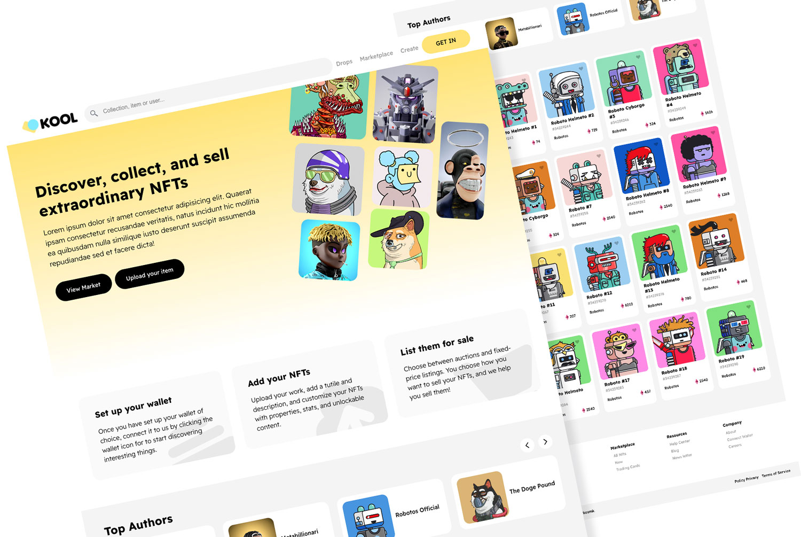

# Project: Web NFT Kool with ReactJs

Project to practice the use of APIs, and dynamic routes in react, You can see it in action here [(Ver Online)](https://markosmk.github.io/nft-react-front/)

## Applied tools

- React v17+
- React Router v6
- Axios
- React Slick (carousel)
- Styles (module css)
- Api Opensea NFTs

## Available Scripts

In the project directory, you can run:

### `yarn start`

Runs the app in the development mode.\
Open [http://localhost:3000](http://localhost:3000) to view it in the browser.
